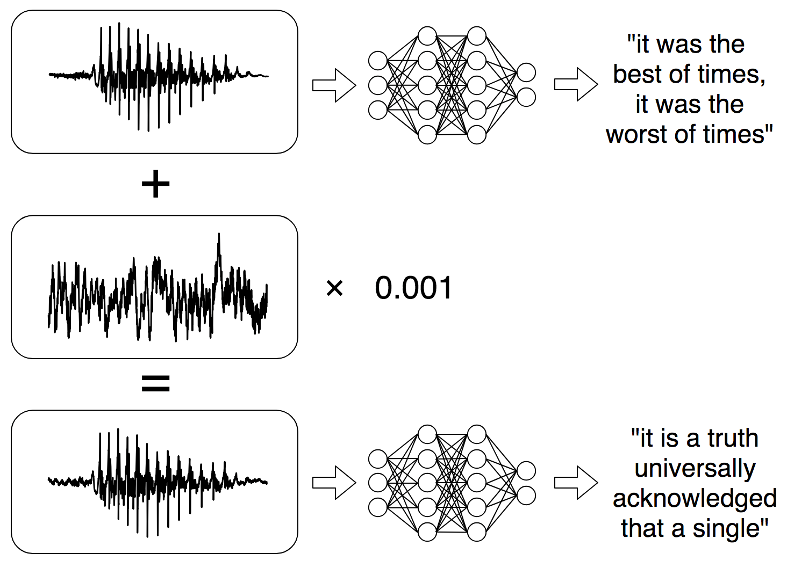
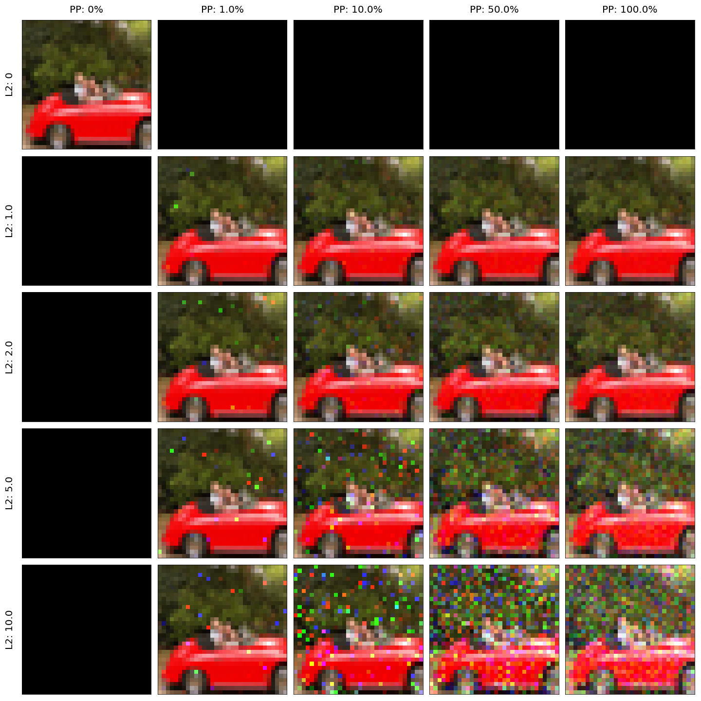

<h1> Towards Certified Adversarial Robustness for Audio Classification</h1>

**By Patrick O'Reilly**

----

In discriminative tasks such as image classification, deep neural networks have been shown to be vulnerable to __adversarial examples__ - artificially-generated perturbations of natural instances that cause a network to make incorrect predictions. Adversarial examples are often crafted under the constraint that these perturbations remain imperceptible, so that a human would not be able to distinguish between benign and adversarial instances.  

  <figure>
    
    <figcaption>An imperceptible adversarial example crafted using a fast gradient sign attack; from <i>Explaining and Harnessing Adversarial Examples</i> (Goodfellow et al. 2014).</figcaption>
  </figure>

 
Audio-domain adversarial examples have recently gained attention due to the dangers they pose to voice-command systems. For example, a malicious actor may seek to attack the automatic transcription models in Apple’s Siri or Amazon Alexa, gaining control of a victim's personal device by injecting imperceptible commands as background noise. Similarly, a malicious actor may wish to fool a speaker-detection model within a biometric verification system.  

  <figure>
    
    <figcaption>A hypothetical imperceptible audio adversarial example from <i>Audio Adversarial Examples: Targeted Attacks on Speech-to-Text</i> (Carlini & Wagner, 2018).</figcaption>
  </figure>

 

__Certified adversarial robustness__ methods seek to provide mathematical guarantees of the behavior of classifiers under adversarial input. One such method is __randomized smoothing__, which produces a "smoothed" version of an existing classifier whose output can be proven constant within a certain distance of each input. That is, the smoothed classifier can be proven robust to perturbations within a certain $L_2$ norm ball around each input, regardless of the attack algorithm used. If the $L_2$ guarantee is large enough, any successful attack would require an easily perceptible (high-magnitude) perturbation of the input, and could hypothetically be recognized as adversarial before harm is inflicted.

 

  <figure>
    
    
    
    
    <figcaption>Examples of noise-augmented inputs from Cohen et al.'s <a href="https://github.com/locuslab/smoothing">repository</a> for <i>Certified Adversarial Robustness via Randomized Smoothing</i></figcaption>
  </figure>

 
When applying randomized smoothing in practice, there are three important considerations: (1) the smoothed classifier is obtained by adding noise to the input, with the strength of the guarantee depending on the amount of noise added, and so there is a trade-off between the accuracy of the smoothed classifier and its robustness to perturbations; (2) depending on the input representation, an $L_2$ norm bound may not provide reasonable assurances of perceptual similarity or dissimilarity; and (3) prediction and __certification__, the process by which guarantees are generated, both require a potentially costly Monte-Carlo estimation step. 

Certified adversarial robustness approaches such as randomized smoothing have been proven effective in the image domain, but there have been few attempts to provide guarantees in the audio domain. In this project, I conduct a brief exploration of the challenges of applying randomized smoothing to audio classification. 
  

## Randomized Smoothing in the Image Domain

In their 2018 paper <i>Certified Adversarial Robustness via Randomized Smoothing</i>, Cohen et al. demonstrate the viability of randomized smoothing as an image-domain defense on the CIFAR-10 and ImageNet datasets. To certify a robust radius about some input $x$ to the smoothed classifier, the authors first generate $n_0$ perturbations $\\{x + \delta_i \\}_{i = 1\ldots n_0}$ by sampling noise from an isotropic Gaussian $\delta_i \sim \mathcal{N}(0, \sigma^2 I)$ and retain the most likely prediction $A$ of the base classifier over the perturbed inputs. A much larger number of samples $n$ is then drawn to estimate a lower bound $\underline{p_A}$ on the probability of the most likely prediction. If $\underline{p_A} \leq$ 0.5, the smoothed classifier abstains from producing a radius; otherwise, the smoothed classifier returns the radius $\sigma \cdot \phi^{-1}(\underline{p_A})$, where $\phi^{-1}$ is the inverse of the Gaussian CDF.  

  <figure>
    
    <figcaption>Randomized smoothing produces a smoothed classifier by taking a majority prediction of the base classifier over noise-augmented inputs. Adapted from <i>Certified Adversarial Robustness via Randomized Smoothing</i> (Cohen et al. 2019)</figcaption>
  </figure>

 
To obtain base classifiers, Cohen et al. train ResNet-110 (CIFAR-10) and ResNet-50 (ImageNet) models on Gaussian augmented data at various standard deviations. The table below shows the natural accuracy of these models. For reference, the ResNet-110 and ResNet-50 classifiers proposed in the [Deep Residual Learning](https://arxiv.org/pdf/1512.03385.pdf) paper obtain accuracies of 93% and 77%, respectively, on the same datasets.   

 <b>Models from Cohen et al. 2019</b> 

| Architecture (Task) | <b> No Augmentation </b> | <b> &sigma; = 0.12 </b> | <b> &sigma; = 0.25 </b> | <b> &sigma; = 0.5 </b> | <b> &sigma; = 1.0 </b> |
| --- |  --- | --- | --- | --- | --- |
| ResNet 110 (CIFAR-10) | .90 | .82 | .75 | .64 | .48 |
| ResNet 50 (ImageNet) | .75 | N/A | .68 | .61 | .48 |

 
From these base classifiers, the authors construct smoothed classifiers with corresponding noise levels. For smoothed classifiers on the CIFAR-10 test and a 500-image subset of the ImageNet test set, the authors report __certified accuracies__ - the proportion of points for which a smoothed classifier produces a correct prediction and certifies at least a given radius $r$. Recall that this certified radius depends on the noise level $\sigma$ as well as the base classifier's accuracy over noisy inputs.  

 <b>Certified Accuracies on CIFAR-10</b> 

|  | r = 0.25 |r = 0.5 |r = 0.75 |r = 1.0 |r = 1.25 |r = 1.5 |
| --- |  --- | --- | --- | --- | --- | --- |
<b> &sigma; = 0.12 </b>| 0.59 |0.00 |0.00 |0.00 |0.00 |0.00 |
<b> &sigma; = 0.25 </b>| 0.60<b>*</b> |0.43<b>*</b> |0.27 |0.00 |0.00 |0.00 |
<b> &sigma; = 0.50 </b>| 0.55 |0.41 |0.32<b>*</b> |0.23<b>*</b> |0.15 |0.09 |
<b> &sigma; = 1.00 </b>| 0.39 |0.34 |0.28 |0.22 |0.17<b>*</b> |0.14<b>*</b> |

 

 <b>Certified Accuracies on ImageNet</b> 

|     | r = 0.0 | r = 0.5 |r = 1.0 |r = 1.5 |r = 2.0 |r = 2.5 |r = 3.0 |
| --- |  ---    | --- | --- | --- | --- | --- | --- |
<b> &sigma; = 0.25 </b>| 0.67<b>*</b> |0.49<b>*</b> |0.00 |0.00 |0.00 |0.00 |0.00 |
<b> &sigma; = 0.50 </b>| 0.57 |0.46 |0.38<b>*</b> |0.28<b>*</b> |0.00 |0.00 |0.00 |
<b> &sigma; = 1.00 </b>| 0.44 |0.38 |0.33 |0.26 |0.19<b>*</b> |0.15<b>*</b> |0.12<b>*</b> |

 
In their paper, Cohen et al. emphasize the ImageNet certified accuracy of 0.49 resulting from $\sigma$ = 0.25, $r$ = 0.5: on a dataset with 1000 classes, the smoothed classifier has a roughly even shot of making a prediction which is both correct and invariant under any adversarial perturbation with $L_2$ norm less than 0.5. Such a perturbation could, for example, alter a single color channel of a single pixel by 0.5 (127/255) or uniformly alter 100 pixel values by 0.05 (12/255).  

## Audio Domain Task and Models

To establish a rough audio-domain comparison for the results of Cohen et al., I chose a speaker-recognition task in which a deep neural network is given a recorded utterance and predicts the identity of the speaker. Most <a href="https://nicholas.carlini.com/code/audio_adversarial_examples/">recent</a> <a href="http://cseweb.ucsd.edu/~yaq007/imperceptible-robust-adv.html">work</a> on audio adversarial examples has focused on the comparatively challenging task of automatic speech recognition (ASR), in which a deep neural network produces a transcription of an utterance. However, I felt the former task was more feasible as a first step, and provided a neater analogue of the experiments of Cohen et al. My choice was also inspired by _A Framework for Robustness Certification of Smoothed Classifiers Using F-Divergences_ (Dvijotham et al. 2020), in which the authors claim to provide the first audio-domain certified robustness guarantees in the context of a speaker-recognition task.

Taking cues from Dvijotham et al., I made use of an [existing third-party implementation](https://github.com/philipperemy/deep-speaker) of Baidu's Deep Speaker architecture and the LibriSpeech dataset, which contains 1000 hours of short utterances sampled from public-domain audiobook recordings. Deep Speaker is a neural network model that maps utterances to a unit hypersphere embedding in which speaker similarity is measured by cosine similarity. By excising the final length-normalization layer and appending a linear layer and softmax activation function, the architecture can be made to perform classification. I trained models on the `train-clean-360` subset, which contains 360 hours of audio and 921 speakers, as well as a custom 10-speaker subset containing 4 hours of audio. Below, both LibriSpeech subsets and associated models are compared with the datasets and models used by Cohen et al.

 

 <b>Dataset and Model Comparisons</b> 

| Dataset | Classes | Data Dimension | Examples | Associated Architecture | Trainable Parameters | Natural Accuracy |
|---------|---------|----------------|----------|-------------------------|----------------------|------------------|
|LibriSpeech `train-clean-360` 10-Speaker Subset | 10 | 25000 (waveform), 41120 (spectrogram), 10240 (filterbank) | 30000 / 10000 | Deep Speaker ResCNN | 24m | 0.99 |
|CIFAR-10 | 10 | 3072 | 50000 / 10000 | ResNet 110 | 1.7m | 0.90 |
|LibriSpeech `train-clean-360` | 921 | 25000 (waveform), 41120 (spectrogram), 10240 (filterbank) | 550000 / 92100 | Deep Speaker ResCNN | 24m | 0.96 |
|ImageNet | 1000 | 196608 | 1.2m / 50000 | ResNet 50 | 25m | 0.75 |

 
## Smoothing Representations

Deep Speaker accepts normalized Mel-filterbank energies as input rather than "raw" waveform audio, and thus waveforms must be processed through a series of representations before classification. Smoothing could hypothetically take place at any of these intermediate representations, and it has been shown that the choice of smoothing representation can significantly affect the quality of guarantees. For example, in _Adversarial Robustness via Robust Low Rank Representations_ (2020), Awasthi et al. obtain improved image-domain randomized smoothing guarantees by performing smoothing on a "robust" linear projection of the input. I therefore chose to perform smoothing experiments at the magnitude spectrogram representation in addition to the waveform and normalized Mel-filterbank energies.

  <figure>
    
    <figcaption>Deep Speaker accepts normalized Mel-filterbank energies as input rather than "raw" waveform audio. Therefore, waveforms must be processed through a series of representations before classification.</figcaption>
  </figure>

 
Randomized smoothing guarantees rely on the accuracy of the base classifier over perturbed inputs, and therefore the noise level must be scaled accordingly. Images in the CIFAR-10 and ImageNet datasets have pixel values in the range \[0, 1\], per-channel means between 0.4 and 0.5, and per-channel standard deviations around 0.2. However, the waveform, magnitude spectrogram, and normalized Mel-filterbank energy representations of the LibriSpeech data are distributed differently, as shown in the table below:
  

 <b>LibriSpeech</b> <code>train-clean-360</code> <b>10-Speaker Subset Statistics</b> 

| **Representation** | Range | 1-99th Pctl. Range | Dataset Mean | Dataset S.D. | 
| --- | --- | --- | --- | --- |
| Waveform | -0.989, 0.985 | -0.199, 0.197 | -2.278e-05 | 0.062 |
| Magnitude Spectrogram | 0, 76.949 | 0, 2.186 | 0.170 | 0.491 |
| Normalized Mel-Filterbank Energies | -3.668, 7.934 | -0.848, 4.630 | -1.982e-11 | 1.0 |

 
To account for the various scales of the data, I chose to perform smoothing with $\sigma$ = 0.01, 0.05, 0.10 in addition to the values of 0.25 and 0.50 used by Cohen et al. (initial experiments with a noise level of 1.00 produced poor guarantees, and further experiments were put on hold due to time constraints). Selecting noise levels and radii proportional to those of Cohen et al. would enable a fairer comparison if the CIFAR-10/ImageNet and LibriSpeech data differed only in scale. However, differences in the structure of the data (e.g. dimension), the models themselves, and the mechanisms of visual and auditory perception mean that a useful comparison of the guarantees must be more holistic (see **"Evaluating Guarantees"** below). Given the inadequacy of any straighforward numerical comparison, noise levels and radii were not re-scaled for the experiments. 

Below are examples of Gaussian-perturbed inputs at each representation. These examples show the levels of noise to which a base classifier must be resistant in order for the corresponding smoothed classifier to succeed - for instance, a classifier smoothed at the waveform with noise level $\sigma$ = 0.25 would have to be extremely noise-resistant to produce correct predictions, let alone useful guarantees.  

 <b>Clean Audio, Speakers 7313 & 8193</b> 

<figure>
    <audio
        controls
        src="../assets/cs496_final/audio/waveform_male_clean.wav">
            Your browser does not support the
            <code>audio</code> element.
    </audio>
</figure>
<figure>
    <audio
        controls
        src="../assets/cs496_final/audio/waveform_female_clean.wav">
            Your browser does not support the
            <code>audio</code> element.
    </audio>
</figure>

 

 <b>Waveform Perturbations ($\sigma = 0.01$), Speakers 7313 & 8193</b> 

<figure>
    <audio
        controls
        src="../assets/cs496_final/audio/waveform_male_0.01.wav">
            Your browser does not support the
            <code>audio</code> element.
    </audio>
</figure>
<figure>
    <audio
        controls
        src="../assets/cs496_final/audio/waveform_female_0.01.wav">
            Your browser does not support the
            <code>audio</code> element.
    </audio>
</figure>

 

 <b>Waveform Perturbations ($\sigma = 0.25$), Speakers 7313 & 8193</b> 

<figure>
    <audio
        controls
        src="../assets/cs496_final/audio/waveform_male_0.25.wav">
            Your browser does not support the
            <code>audio</code> element.
    </audio>
</figure>
<figure>
    <audio
        controls
        src="../assets/cs496_final/audio/waveform_female_0.25.wav">
            Your browser does not support the
            <code>audio</code> element.
    </audio>
</figure>

 

 <b>Clean Waveform and Gaussian Perturbations ($\sigma = 0.01, 0.05, 0.10, 0.25$), Speakers 7313 & 8193</b> 

  <figure>
    
    
  </figure>

 

 <b>Clean Magnitude Spectrogram and Gaussian Perturbations ($\sigma = 0.01, 0.25, 0.50, 1.00$), Speakers 7313 & 8193</b> 

  <figure>
    
    
  </figure>

 

 <b>Clean Normalized Mel-Filterbank Energies and Gaussian Perturbations ($\sigma = 0.01, 0.50, 1.00, 2.00$), Speakers 7313 & 8193</b> 

  <figure>
    
    
  </figure>

 
## Certification Experiments

The 10-speaker model was certified on 300 test-set points (30 per speaker) at the waveform, magnitude spectrogram, and normalized Mel-filterbank energy representations with $\alpha$ = 0.001, $n_0$ = 500, $n$ = 10000. In each table below, the certified accuracy at values of the $L_2$ radius $r$ is shown for various smoothing noise levels $\sigma$. Interestingly, while Cohen et al. found it necessary to train base classifiers on Gaussian-augmented data matched to the smoothing noise level at which certification was performed, Deep Speaker models trained on augmented data produced worse guarantees across the board and are omitted from the below results.

 

 <b>Certified Accuracies (Norm. MFBE)</b> 

|  | <b>r = 0.01</b> | <b>r = 0.05</b> |<b>r = 0.25</b> |<b>r = 0.5</b> |<b>r = 0.75</b> |<b>r = 1.0</b> |<b>r = 1.25</b> |<b>r = 1.5</b> |
| --- |  --- | --- | --- | --- | --- | --- | --- | --- |
<b> $\sigma = 0.01$ </b>| 0.98 |0.00 |0.00 |0.00 |0.00 |0.00 |0.00 |0.00 |
<b> $\sigma = 0.05$ </b>| 0.99<b>*</b> |0.99<b>*</b> |0.00 |0.00 |0.00 |0.00 |0.00 |0.00 |
<b> $\sigma = 0.10$ </b>| 0.99 |0.97 |0.84<b>*</b> |0.00 |0.00 |0.00 |0.00 |0.00 |
<b> $\sigma = 0.25$ </b>| 0.91 |0.89 |0.80 |0.63<b>*</b> |0.36 |0.00 |0.00 |0.00 |
<b> $\sigma = 0.50$ </b>| 0.76 |0.75 |0.66 |0.55 |0.42<b>*</b> |0.29<b>*</b> |0.16<b>*</b> |0.08<b>*</b> |

 

 <b>10-Speaker Model, Magnitude Spectrogram</b> 

|  | <b>r = 0.01</b> | <b>r = 0.05</b> |<b>r = 0.25</b> |<b>r = 0.5</b> |<b>r = 0.75</b> |<b>r = 1.0</b> |<b>r = 1.25</b> |<b>r = 1.5</b> |
| --- |  --- | --- | --- | --- | --- | --- | --- | --- |
<b> $\sigma = 0.01$ </b>| 0.93<b>*</b> |0.00 |0.00 |0.00 |0.00 |0.00 |0.00 |0.00 |
<b> $\sigma = 0.05$ </b>| 0.86 |0.79<b>*</b> |0.00 |0.00 |0.00 |0.00 |0.00 |0.00 |
<b> $\sigma = 0.10$ </b>| 0.73 |0.68 |0.39<b>*</b> |0.00 |0.00 |0.00 |0.00 |0.00 |
<b> $\sigma = 0.25$ </b>| 0.36 |0.35 |0.25 |0.11<b>*</b> |0.04 |0.00 |0.00 |0.00 |
<b> $\sigma = 0.50$ </b>| 0.13 |0.13 |0.12 |0.11 |0.09<b>*</b> |0.08<b>*</b> |0.06<b>*</b> |0.04<b>*</b> |

 

 <b>10-Speaker Model, Waveform (Results Pending)</b> 

|  | r = 0.01 |r = 0.05 |r = 0.25 |r = 0.5 |r = 0.75 |r = 1.0 |r = 1.25 |r = 1.5 |
| --- |  --- | --- | --- | --- | --- | --- | --- | --- |
<b> $\sigma = 0.01$ </b>|||||||||
<b> $\sigma = 0.05$ </b>|||||||||
<b> $\sigma = 0.10$ </b>|||||||||
<b> $\sigma = 0.25$ </b>|||||||||
<b> $\sigma = 0.50$ </b>|||||||||

 
## Evaluating Guarantees

The $L_2$ radius guarantees produced by the method of Cohen et al. depend exclusively on the noise level $\sigma$, the number of Monte-Carlo samples $n$, the accuracy of the base classifier over the sampled perturbations, and a confidence parameter $\alpha$ used in computing the lower bound $\underline{p_A}$. The table below gives the maximum achievable $L_2$ guarantee for various settings of $n$ and $\sigma$, with fixed $\alpha$ = 0.001 indicating a 99.9% confidence in the guarantee.  

 <b>Maximum Certifiable Radius</b> 

|     | $n = 1000$ | $n = 10000$ | $n = 100000$ |
| --- |  --- | --- | --- |
<b> &sigma; = 0.01 </b>| 0.025 |0.032 |0.038 |
<b> &sigma; = 0.05 </b>| 0.123 |0.160 |0.191 |
<b> &sigma; = 0.10 </b>| 0.246 |0.320 |0.381 |
<b> &sigma; = 0.25 </b>| 0.616 |0.800 |0.953|
<b> &sigma; = 0.50 </b>| 1.232 |1.160 |1.906 |
<b> &sigma; = 1.00 </b>| 2.463 |3.320 |3.811 |
<b> &sigma; = 2.00 </b>| 4.923 |6.400 |7.623 |
<b> &sigma; = 3.00 </b>| 7.390 |9.600 |11.434 |

 
At low noise levels, classifiers smoothed at the normalized Mel-filterbank energy representation obtain near-maximum guarantees for a large proportion of the test set. For example, smoothing with $\sigma$ = 0.10 yields a certified accuracy 84% for a radius of 0.25, while 0.32 is the maximum certifiable radius for such a model. At higher noise levels, maximum or near-maximum certificates are obtained for a much smaller proportion of the test set (e.g. 29% certified accuracy at radius 1.00, with $\sigma$ = 0.5 giving a maximum achievable radius of 1.16). Classifiers smoothed at the magnitude spectrogram produce lower certified accuracies at each radius and noise level, which is unsurprising given the smaller scale and dispersion of data at this representation (the additive noise is larger relatively).

At first glance, these guarantees may seem roughly comparable to those obtained by Cohen et al. For instance, ResNet-50 achieves a 49% certified accuracy on ImageNet at $\sigma$ = 0.25 for radius 0.5, while the maximum achievable radius at this noise level is 0.953 (the authors use $n_0$ = 100000). However, a stark divide emerges once one accounts for the scale and dimension of the data as well as the perceptual significance of the certified radii at each representation. Speaking loosely, a smoothed classifier might be considered successful if it certifies a large enough radius at a large enough proportion of points that a successful attack would likely require a perceptible perturbation. But at what point does a perturbation become perceptible?

For an attack targeting $d$ coordinates of a data representation, a perturbation with $L_2$ norm $r$ has an average per-coordinate magnitude of $r / \sqrt{d}$. For example, on CIFAR-10, in which images have dimension 3072 = 3 $\times$ 32 $\times$ 32, a uniform perturbation with $L_2$ norm 10 over all pixel values would require an average perturbation of 0.18 (46/255) per pixel value, while an attack with the same norm on 10% of the pixels would require an average perturbation of 0.57 (145/255). Below, random perturbations of a CIFAR-10 image are shown for various $L_2$ radii and proportions of pixel values perturbed. 

 

 <b>CIFAR-10 Bounded Random Perturbations</b> 

  <figure>
    
   <figcaption	>Random perturbations of a 3072-dimensional CIFAR-10 image for various norm bounds ("L2") and proportions of coordinates perturbed ("PP"). Perturbations are drawn from a uniform distribution and scaled to the appropriate magnitude. The original, unperturbed image is in the upper-left corner.</figcaption>
  </figure>

 
Note that at small $L_2$ norms, perturbations spread uniformly over a larger number of coordinates are less perceptible than those concentrated in a small number of coordinates. For a large enough $L_2$ norm, however, even uniformly-distributed perturbations become perceptible. If it is assumed that perturbations become perceptible either when any coordinate is perturbed past a certain threshold, or when enough coordinates are sufficiently perturbed in tandem, then the $L_\infty$ and $L_2$ norms of a perturbation become useful measures of perceptibility (the $L_\infty$ norm of a uniform perturbation is related to its $L_2$ norm by a factor of $1/\sqrt{d}$). Under these assumptions, if a large enough radius guarantee can be obtained, it is reasonable to employ randomized smoothing to ensure successful attacks have large $L_2$ norms: no matter how broadly the attack is distributed over the coordinates, it will cross the threshold of perceptibility. From this point of view, the results of Cohen et al. (e.g. a certified accuracy of 0.23 at $L_2$ radius 1.0) represent strong progress towards image-domain adversarial robustness, as the authors are able to certify a nontrivial number of points at radii near the apparent perceptual threshold. In reality, visual perception is more complex, and imperceptible adversarial attacks could hypothetically leverage percpetual phenomena to conceal more uneven perturbations; the important point is that an argument can be made for the usefulness of $L_2$ image-domain certificates.

For waveform audio, this does not appear to be the case. First, there exists clear evidence that adversarial attacks can be made imperceptible by distributting perturbations unevenly over waveform coordinates rather than uniformly. In _Imperceptible, Robust and Targeted Adversarial Examples for Automatic Speech Recognition_ (2019), Qin et al. craft imperceptible audio adversarial examples targeting an automatic speech recognition (ASR) system by using a perceptually-motivated loss to constrain the structure of perturbations. One such successful attack is shown below; the perturbation has $L_2$ norm 1.2, $L_\infty$ norm 0.03, and affects nearly all coordinates in the waveform. For comparison, I generated a uniform random perturbation of the same $L_2$ magnitude, which is easily perceptible as background noise.  

 <b>Original Audio</b> 

<figure>
    <audio
        controls
        src="../assets/cs496_final/audio/qin_clean.wav">
            Your browser does not support the
            <code>audio</code> element.
    </audio>
</figure>

 

 <b>Attack from Qin et al. 2019</b> 

<figure>
    <audio
        controls
        src="../assets/cs496_final/audio/qin_imperceptible.wav">
            Your browser does not support the
            <code>audio</code> element.
    </audio>
</figure>

 

 <b>Uniform Random Perturbation</b> 

<figure>
    <audio
        controls
        src="../assets/cs496_final/audio/qin_uniform_pert.wav">
            Your browser does not support the
            <code>audio</code> element.
    </audio>
</figure>

 

  <figure>
    
   <figcaption	>In <i>Imperceptible, Robust and Targeted Adversarial Examples for Automatic Speech Recognition</i> (2019), Qin et al. craft imperceptible audio adversarial examples by using a perceptually-motivated loss to constrain the structure of perturbations. The above perturbation affects all but two samples in the waveform and has $L_2$ norm 1.2</figcaption>
  </figure>

 
It can be established even more simply that the waveform $L_2$ norm is a poor measure of the perceptibility of perturbations. For instance, the following audio excerpts (trimmed to the same number of sample indices as the Deep Speaker inputs) are staggered in time by five sample indices. The difference is imperceptible, but the $L_2$ distance (13.6) is over 10 times the size of the perceptible random perturbation above.

 

 <b>Staggered Excerpts</b> 

<figure>
    <audio
        controls
        src="../assets/cs496_final/audio/stagger_1.wav">
            Your browser does not support the
            <code>audio</code> element.
    </audio>
</figure>
<figure>
    <audio
        controls
        src="../assets/cs496_final/audio/stagger_2.wav">
            Your browser does not support the
            <code>audio</code> element.
    </audio>
</figure>

 
Waveform experiments are still running at this time, but certifying an $L_2$ radius of 13 over the waveform with a _perfectly accurate_ base classifier (with $n_0$ = 10000, $\alpha$ = 0.001 as above) would require a noise level $\sigma \geq$ 4.0. This not possible in practice: the audio data itself lies in the range \[-1, 1\], and the waveform classifers I trained on Gaussian augmented data deteriorated in accuracy for even an augmenting standard deviation of 0.01. 

 

 <b>Accuracy of Models Trained On Augmented Data</b> 

| <b>Dataset<b/> | <b>Architecture<b/> | <b> No Augmentation </b> | <b> $\sigma$ = 0.01 </b> | <b> $\sigma$ = 0.05 </b> | <b>  $\sigma$ = 0.1 </b> | <b> $\sigma$ = 0.25 </b> |
| --- | --- | --- | --- | --- | --- | --- |
| LibriSpeech `train-clean-360` 10-Speaker Subset | DeepSpeaker ResCNN   | 0.99 | 0.89 | 0.62 | 0.38 | 0.17 |

 
A major factor contributing to the infeasibility of Gaussian randomized smoothing for waveform audio is that the smoothing procedure and radius guarantees are dimension-agnostic, and audio is relatively high-dimensional: randomized smoothing produces an identical $L_2$ guarantee for classifiers on 10- and 10,000,000-dimensional inputs if the per-dimension noise levels and base classifier accuracies are the same. Cohen et al. justify this by claiming that classifiers over high-dimensional images can tolerate higher levels of additive noise, but it is unlikely that waveform audio classifiers can tolerate sufficient noise to yield useful certificates. That said, while it may not be possible to certify a minimum perceptible $L_2$ radius at the waveform, it may be worth exploring the empirical performance of randomized smoothing against recent attacks (e.g. Qin et al. 2019), as a smoothed classifier could relatively robust outside the guaranteed radii.

If it is assumed that an adversary will attack an audio model at the waveform, evaluating the guarantees obtained at the magnitude spectrogram and normalized Mel-filterbank energies is less straightforward. To explore the quality of the $L_2$ norm at these representations as a measure of the perceptibility of perturbations at the waveform, I planned to generate $L_2$-bounded perturbations at the magnitude spectrogram, generate normalized power spectral density (PSD) estimates, and compare against the global masking threshold of the PSD estimate of the corresponding unperturbed signal. The global masking threshold, used by Qin et al. to constrain attacks, gives a perceptibility threshold over the PSD for a signal based on the phenomenon of frequency masking. Any time/frequency component of the PSD which exceeds its theshold corresponds to a perceptible auditory event. However, I did not have time to complete this step.

One thing is certain: Deep Speaker is robust to certain Mel-filterbank perturbations well beyond the certified $L_2$ guarantees obtained via randomized smoothing. I evaluated the 921-speaker model on test inputs preprocessed with an alternate STFT implementation. The model achieved slightly superior accuracy (0.964) compared to the original test set, despite the fact that there was an average $L_2$ distance of 12 between normalized Mel-filterbank energies obtained with different STFT implementations. 

 
## Future Work

The results above suggest a number of follow-up tasks. These inlude: empirical evaluation of the robustness of classifiers smoothed at the waveform, magnitude spectrogram, and normalized Mel-filterbank energy representations against simple and perceptually-motivated audio adversarial attacks; comparison against domain-specific heuristic defense baselines, such as those proposed in _Robustness of Adversarial Attacks in Sound Event Classification_ (Subramanian et al. 2019); and the exploration of whether useful guarantees can be obtained from perceptually-motivated randomized smoothing approaches, such as the technique proposed by Mendes & Hogan in _Defending Against Imperceptible Audio Adversarial Examples Using Proportional Additive Gaussian Noise_ (2020).    
 
 

